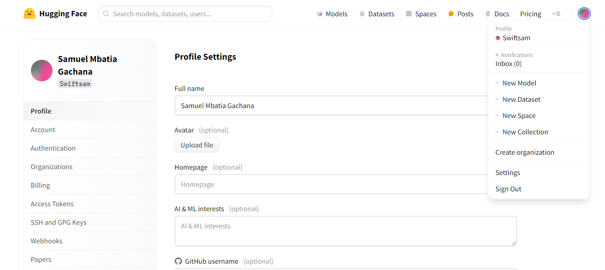
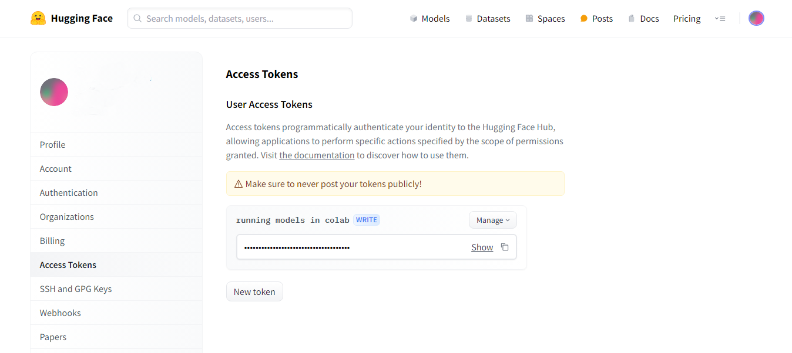
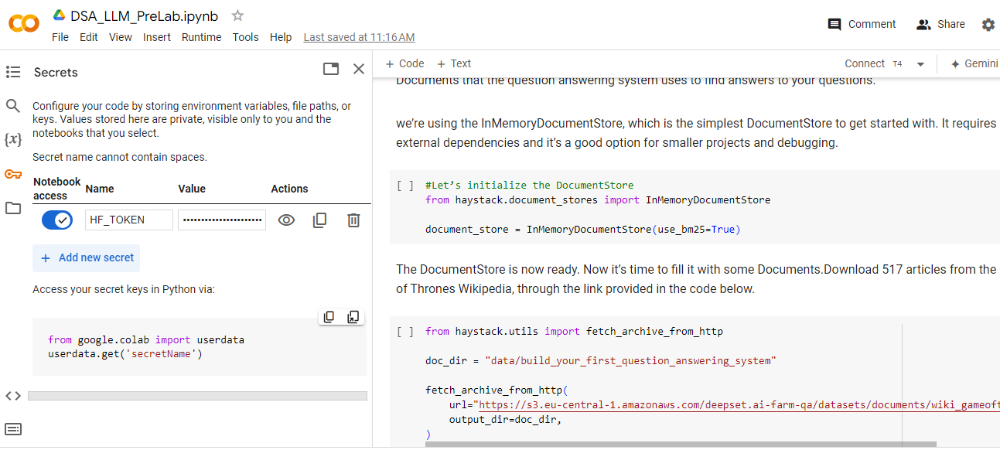

# DSA 2024 NLP

© DSA 2024. Apache License 2.0.

Contributors : `Samuel Mbatia`, `Teofilo Ligawa`, `Cedric Kiplimo`, `Andreas Damianou`

**Introduction**

[Natural language processing (NLP)](https://www.oracle.com/ke/artificial-intelligence/what-is-natural-language-processing/) is the ability of a computer program to understand human language as it's spoken and written - referred to as natural language. It's a component of artificial intelligence (AI).Natural language processing has the ability to interrogate the data with natural language text or voice.

## Prelab Work
Welcome to the DSA 2024 prelab section. Here, you will find NLP tasks to help you warm up in readiness for the main NLP session. The prelab work tasks have been broken down into three parts:
* [Basic NLP](#a-basic-nlp)
* [Large Language Models (LLMs) with Google Colab and Hugging Face Models](#b-large-language-models-llms-with-google-colab-and-huggingface)
* [Prompt Engineering](#c-prompt-engineering-with-llama-2)

For each of these parts, a separate notebook has been provided for you to run on colab. Each notebook has detailed instructions on how to complete the tasks. At the top of each notebook is an `Open in Colab` button you can click to get things started quickly.

Before we get started, let's have a look at what is covered in each section as well as the prerequisites.

**Prerequisites:**
- Basic knowledge of Python Programming. If new to you, check out this [crash course](https://youtu.be/kqtD5dpn9C8?feature=shared)
- A [Google Colab](https://colab.research.google.com/) account
- A [Hugging Face](https://huggingface.co/join)  account

- When done creating the hugging face account ,you have to create an acess token and load it into your Google Colab so as to acess some models.
- 
  * access the settings part on the top right hand side
  
  
  * access the tokens and create one.Choose the write type.
  
  
  * input it into your colab,then you are ready to go.
  

### A. Basic NLP
**Duration: 30 minutes**

In the basic NLP section, the focus shall be to familiarize with some foundational concepts in NLP.

Some of the areas covered in this section include:
* Stemming
* Lemmatization
* Stopwords
* Tokenization
* Text Vectorization
* Next word probability

#### Learning Objectives
* Distinguish between stemming and lemmatization.
* Describe stopwords and why they are removed.
* Describe tokenization in the context of NLP.
* Understand various vectorization techniques.
* Use probability to predict the next word in a sentence.

To complete the tasks in this part, 

If you wish to save changes you make to the notebook, please create your own copy.

### B. Large Language Models (LLMs) with Google Colab and Huggingface
**Duration: 30 minutes**

A large language model (LLM) is a statistical language model, trained on a massive amount of data, that can be used to generate and translate text and other content, and perform other natural language processing (NLP) tasks.

LLMs are typically based on deep learning architectures, such as the Transformer developed by Google in 2017, and can be trained on billions of text and other content. Text-driven LLMs are used for a variety of natural language processing tasks, including text generation, machine translation, text summarization, question answering, and creating chatbots that can hold conversations with humans.

LLMs can also be trained on other types of data, including code, images, audio, video, and more. Google’s [Codey](https://cloud.google.com/vertex-ai/docs/generative-ai/code/code-models-overview), [Imagen](https://cloud.google.com/vertex-ai/docs/generative-ai/image/overview) and [Chirp](https://cloud.google.com/vertex-ai/docs/generative-ai/speech/speech-to-text) are examples of such models that will spawn new applications and help create solutions to the world’s most challenging problems.

LLMs are pre-trained on a massive amount of data. They are extremely flexible because they can be trained to perform a variety of tasks, such as text generation, summarization, and  Question Answering e.t.c. They are also scalable because they can be fine-tuned to specific tasks, which can improve their performance.

Here we shall utilize [huggingface](https://huggingface.co/models) pretrained models to accomplish tasks such as text generation and text summmarization. Using the steps above to create a huggingface account and accessing your secret token which will eneble the usage of models in colab , make sure the token is inputted into your google colab as shown in the steps above.

#### Learning Objectives
What will be covered in the notebook:
* Use a pretrained models in huggingface to accomplish Text summarization
* Use a pretrained models in huggingface to accomplish Text generation
* To do exercises to challenge yourself

To complete the tasks in this part, click  to open the notebook.

If you wish to save changes you make to the notebook, please create your own copy.

### C. Prompt Engineering with LLaMA-2
**Duration: 15 minutes**

Prompt engineering is the discipline of developing and optimising prompts to effectively use large language models (LLMs) to achieve desired outputs for a wide variety of applications, including research. By developing prompt engineering skills, we are enabled to better understand the capabilities and limitations of these LLMs.

The key aspects of prompt engineering include, but are not limited to:
* Crafting clear prompts: The model's output is significantly affected by the model's output. To get accurate and relevant responses, prompts should be clear, concise, and specific.
* Providing context: Prompts that include sufficient context within them help the models understand the background and generate more informed responses. Contexts can involve giving background information, setting the scene, or specifying the desired format of the answer.
* Iterative refinement: Prompt engineering is often an iterative process where initial prompts are continuously adjusted and refined to improve the quality of the response.
* Instruction precision: Explicity stating what you want from the model can dramatically improve outcomes. Using words like "list", "describe", etc. help guide the model more effectively.
* Balancing length and detail: Although detailed prompts can provide more guidance, overly long prompts tend to confuse the model. Striking a balance between providing enough details and maintaining brevity is important.
* Leveraging special tokens: Some models allow the use of special tokens or specific structures to control responses, such as separators or format indicators. `LLaMA-2` is one such model.

#### Learning Objectives
- Use a `transformers` pipeline to generate responses from a LLaMA-2 LLM.
- Craft prompts that are **specific**.
- Craft prompts that give the model **"time to think"**.
- Provide **cues** to the model to guide its response.

To complete the tasks in this part, click  to open the notebook.

If you wish to save changes you make to the notebook, please create your own copy.

## Questions

Please ask any questions through this [form](https://forms.gle/dbd19Sk1VPydsAtp8)